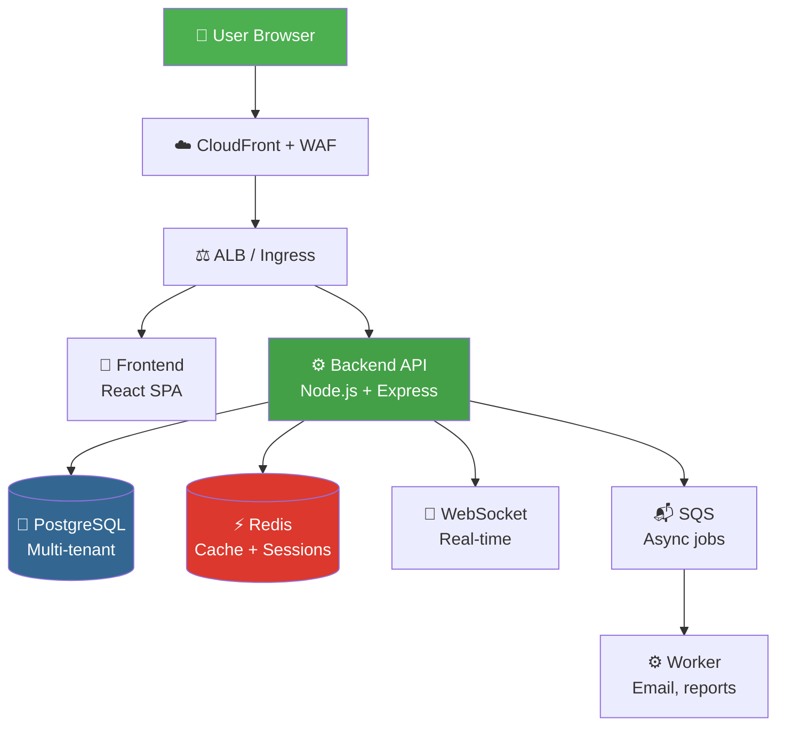
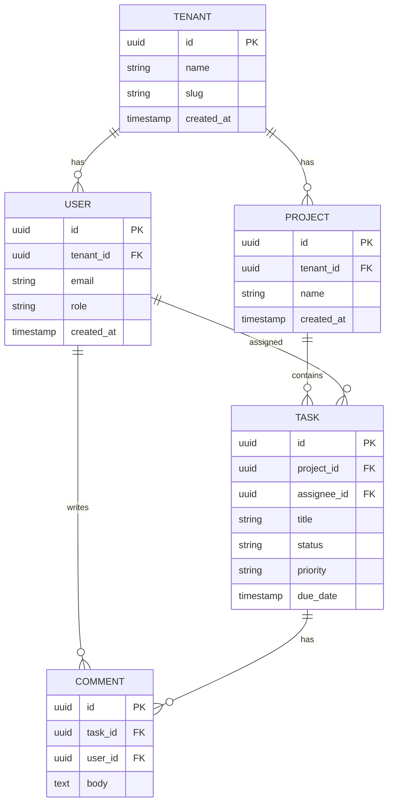
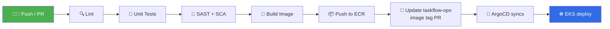
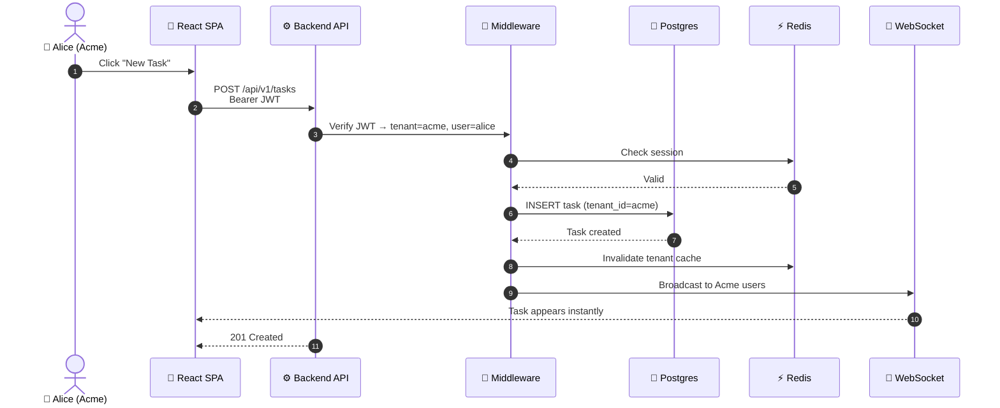

# taskflow-app
"Enterprise task management SaaS — Node.js + React. Deployed on AWS EKS via GitOps."

# 📋 TaskFlow — Enterprise Task Management SaaS

> **Multi-tenant task management platform.** Node.js + React + PostgreSQL + Redis.
> Deployed on AWS EKS via GitOps with full CI/CD, observability, and security.


---

## 📖 Table of Contents

1. [What is TaskFlow](#1-what-is-taskflow)
2. [Business Story](#2-business-story)
3. [Architecture Overview](#3-architecture-overview)
4. [Repository Structure](#4-repository-structure)
5. [Every File — What / Why / Where](#5-every-file--what--why--where)
6. [Tech Stack Decisions](#6-tech-stack-decisions)
7. [Local Development (WSL Ubuntu)](#7-local-development-wsl-ubuntu)
8. [Running Locally with Docker Compose](#8-running-locally-with-docker-compose)
9. [Database Schema](#9-database-schema)
10. [API Endpoints](#10-api-endpoints)
11. [Testing Strategy](#11-testing-strategy)
12. [CI/CD Pipeline](#12-cicd-pipeline)
13. [Troubleshooting Guide](#13-troubleshooting-guide)
14. [Real-Time Example — Multi-Tenant Request Flow](#14-real-time-example--multi-tenant-request-flow)
15. [Root Cause Analysis (Real Incidents)](#15-root-cause-analysis-real-incidents)
16. [Interview Questions & Answers](#16-interview-questions--answers)
17. [How to Explain in Interview](#17-how-to-explain-in-interview)
18. [Related Repository](#18-related-repository)
19. [Best Practices & Lessons](#19-best-practices--lessons)

---

## 1. What is TaskFlow

**TaskFlow** is a **multi-tenant SaaS task manager** for teams — similar to Linear or Asana. Every company (tenant) gets isolated workspaces, users, projects, and tasks.

### Core Capabilities

| Feature | Description |
|---------|-------------|
| Multi-tenancy | Each company = isolated tenant |
| Auth | JWT + refresh tokens |
| RBAC | Owner / Admin / Member / Viewer |
| Projects | Group tasks into projects |
| Tasks | CRUD with assignee, due date, priority |
| Real-time | WebSocket updates |
| Audit log | Every change tracked |
| Search | Full-text task search |

---

## 2. Business Story

### The Problem

Small and mid-size teams (10-200 people) struggle with:
- **Scattered tools** — Trello for boards, Jira for tickets, email for updates
- **No visibility** — Managers don't know project status
- **Expensive enterprise tools** — Asana/Linear charge per-seat aggressively
- **Data silos** — No unified audit trail

### The Ask

> "Build a **self-hostable**, **multi-tenant**, **secure** task manager with real-time updates and audit logs — deployable on any cloud."

### Target Users

| Persona | Needs |
|---------|-------|
| 👤 Team Lead | Assign tasks, view progress |
| 👨‍💻 Developer | Update task status, comment |
| 👔 Manager | Reports, dashboards, audit |
| 🏢 Company Admin | Manage users, billing, security |

### Success Metrics

| Metric | Target |
|--------|--------|
| Uptime | 99.9% |
| API Latency (P95) | < 200ms |
| Users per tenant | 10-200 |
| Tenants | 1,000+ |
| Data isolation | 100% |
| Compliance | SOC2-ready |

---

## 3. Architecture Overview



### Component Roles

| Component | Purpose | Tech |
|-----------|---------|------|
| Frontend | React SPA | Vite + Tailwind |
| Backend | REST + WebSocket API | Node.js + Express + TS |
| Database | Persistent storage | PostgreSQL 16 |
| Cache | Sessions + hot data | Redis 7 |
| Queue | Async jobs | AWS SQS (prod) / Redis (local) |
| Worker | Background jobs | Node.js worker |

---

## 4. Repository Structure

```
taskflow-app/
├── backend/                    # Node.js + Express + TypeScript
│   ├── src/
│   │   ├── config/             # Env, DB, Redis config
│   │   ├── controllers/        # HTTP handlers
│   │   ├── services/           # Business logic
│   │   ├── models/             # DB models (Prisma)
│   │   ├── middleware/         # Auth, tenant, error
│   │   ├── routes/             # Express routes
│   │   ├── utils/              # Helpers
│   │   ├── workers/            # Background jobs
│   │   ├── app.ts              # Express app
│   │   └── server.ts           # Entry point
│   ├── tests/                  # Jest + Supertest
│   ├── prisma/
│   │   └── schema.prisma       # DB schema
│   ├── Dockerfile
│   ├── package.json
│   └── tsconfig.json
├── frontend/                   # React + Vite + Tailwind
│   ├── src/
│   │   ├── components/         # Reusable UI
│   │   ├── pages/              # Route pages
│   │   ├── hooks/              # Custom hooks
│   │   ├── api/                # API client
│   │   ├── store/              # State (Zustand)
│   │   ├── App.tsx
│   │   └── main.tsx
│   ├── public/
│   ├── Dockerfile
│   ├── nginx.conf              # Prod nginx config
│   ├── package.json
│   └── vite.config.ts
├── helm/                       # Helm chart
│   ├── Chart.yaml
│   ├── values.yaml
│   ├── values-dev.yaml
│   ├── values-staging.yaml
│   ├── values-prod.yaml
│   └── templates/
│       ├── backend-deployment.yaml
│       ├── backend-service.yaml
│       ├── frontend-deployment.yaml
│       ├── frontend-service.yaml
│       ├── ingress.yaml
│       ├── hpa.yaml
│       ├── configmap.yaml
│       └── secret.yaml
├── docker-compose.yml          # Local full stack
├── .env.example                # Env template
├── .github/
│   └── workflows/
│       ├── backend-ci.yml      # Build + test + push
│       ├── frontend-ci.yml
│       └── release.yml         # Tag → prod image
├── .dockerignore
├── .gitignore
├── docs/
│   ├── architecture.md
│   ├── api.md
│   └── database.md
├── CONTRIBUTING.md
├── LICENSE
└── README.md
```

---

## 5. Every File — What / Why / Where

| 📄 File | ❓ Why | 🎯 Use | 📍 Where | 🔗 Connects | ⚠️ Without it | 💡 Analogy |
|--------|-------|--------|----------|-------------|---------------|------------|
| `backend/src/server.ts` | Boot Node app | Start HTTP server | Backend root | `app.ts`, DB, Redis | App won't start | Engine ignition |
| `backend/src/app.ts` | Wire Express | Middleware + routes | Backend src | `routes/`, `middleware/` | No routes | Dashboard wiring |
| `backend/src/config/` | Centralize config | Read env vars | Backend src | Everywhere | Hardcoded values | Settings panel |
| `backend/src/middleware/auth.ts` | JWT validation | Verify tokens | Backend src | Every route | No auth | Door key checker |
| `backend/src/middleware/tenant.ts` | Extract tenant | Multi-tenancy | Backend src | All queries | Data leaks | Company ID badge |
| `backend/src/controllers/` | HTTP layer | Parse req, call service | Backend src | services/ | No endpoints | Reception desk |
| `backend/src/services/` | Business logic | Real work happens | Backend src | models/, DB | No business rules | Chef in kitchen |
| `backend/src/models/` | DB access | Prisma queries | Backend src | Postgres | No persistence | Filing cabinet |
| `backend/prisma/schema.prisma` | DB schema | Declare tables | Backend root | Postgres | No tables | Blueprint |
| `backend/Dockerfile` | Containerize API | Build image | Backend root | CI/CD | Can't ship | Lunchbox |
| `frontend/src/App.tsx` | Root component | Route setup | Frontend src | pages/ | No app | Main entrance |
| `frontend/src/api/` | API client | Talk to backend | Frontend src | Backend | No data | Phone line |
| `frontend/nginx.conf` | Serve SPA | Static hosting | Frontend root | nginx container | No prod serve | Building lobby |
| `helm/` | K8s package | Deploy manifests | Repo root | ArgoCD | Manual YAML | IKEA instructions |
| `docker-compose.yml` | Local stack | Run everything | Repo root | Docker | Manual setup | Home lab |
| `.github/workflows/` | CI/CD | Auto build + test | Repo root | GitHub, ECR | No automation | Assembly line |
| `.env.example` | Config template | Show required envs | Repo root | Devs | Confusion | Shopping list |
| `docs/` | Documentation | Explain system | Repo root | Everyone | Tribal knowledge | Owner's manual |

---

## 6. Tech Stack Decisions

| Layer | Choice | Why This vs Others |
|-------|--------|--------------------|
| Backend | Node.js + Express + TS | Fast iteration, biggest ecosystem, type safety |
| Frontend | React + Vite | Fast builds, huge community |
| Styling | Tailwind CSS | Utility-first, no CSS hell |
| State | Zustand | Lighter than Redux, simpler |
| Database | PostgreSQL | ACID, JSON support, row-level security |
| ORM | Prisma | Type-safe, great DX |
| Cache | Redis | Sessions + hot data |
| Auth | JWT + refresh tokens | Stateless, scalable |
| Real-time | WebSocket (Socket.io) | Standard for live updates |
| Testing | Jest + Supertest + Vitest | Industry standard |
| Container | Docker | Universal |
| Orchestration | Kubernetes (kind → EKS) | Job market standard |
| Package | Helm | K8s packaging standard |

---

## 7. Local Development (WSL Ubuntu)

### Install Prerequisites

```bash
# Update system
sudo apt update && sudo apt upgrade -y

# Install essentials
sudo apt install -y curl git build-essential ca-certificates gnupg lsb-release

# Install Docker
curl -fsSL https://get.docker.com | sudo sh
sudo usermod -aG docker $USER
newgrp docker

# Install Node.js 20 (via nvm)
curl -o- https://raw.githubusercontent.com/nvm-sh/nvm/v0.39.7/install.sh | bash
source ~/.bashrc
nvm install 20
nvm use 20

# Install kubectl
curl -LO "https://dl.k8s.io/release/$(curl -L -s https://dl.k8s.io/release/stable.txt)/bin/linux/amd64/kubectl"
sudo install -o root -g root -m 0755 kubectl /usr/local/bin/kubectl

# Install kind
curl -Lo ./kind https://kind.sigs.k8s.io/dl/v0.22.0/kind-linux-amd64
chmod +x ./kind && sudo mv ./kind /usr/local/bin/kind

# Install Helm
curl https://raw.githubusercontent.com/helm/helm/main/scripts/get-helm-3 | bash

# Install k9s (K8s TUI)
curl -sS https://webinstall.dev/k9s | bash

# Install Terraform
wget -O- https://apt.releases.hashicorp.com/gpg | sudo gpg --dearmor -o /usr/share/keyrings/hashicorp-archive-keyring.gpg
echo "deb [signed-by=/usr/share/keyrings/hashicorp-archive-keyring.gpg] https://apt.releases.hashicorp.com $(lsb_release -cs) main" | sudo tee /etc/apt/sources.list.d/hashicorp.list
sudo apt update && sudo apt install terraform

# Install AWS CLI
curl "https://awscli.amazonaws.com/awscli-exe-linux-x86_64.zip" -o "awscliv2.zip"
unzip awscliv2.zip && sudo ./aws/install

# Verify all
docker --version && node --version && kubectl version --client && \
kind --version && helm version && terraform --version && aws --version
```

### Clone & Install

```bash
git clone https://github.com/rakesh-perala/taskflow-app.git
cd taskflow-app
cp .env.example .env
```

---

## 8. Running Locally with Docker Compose

```bash
docker compose up -d --build
docker compose logs -f
```

Access:
- Frontend: http://localhost:5173
- Backend API: http://localhost:3000
- Postgres: localhost:5432
- Redis: localhost:6379

Stop:
```bash
docker compose down
docker compose down -v   # remove volumes
```

---

## 9. Database Schema



---

## 10. API Endpoints

| Method | Path | Purpose | Auth |
|--------|------|---------|------|
| POST | `/api/v1/auth/register` | Register tenant + owner | No |
| POST | `/api/v1/auth/login` | Login | No |
| POST | `/api/v1/auth/refresh` | Refresh token | No |
| GET | `/api/v1/users/me` | Current user | Yes |
| GET | `/api/v1/projects` | List projects | Yes |
| POST | `/api/v1/projects` | Create project | Admin+ |
| GET | `/api/v1/projects/:id/tasks` | List tasks | Yes |
| POST | `/api/v1/tasks` | Create task | Member+ |
| PATCH | `/api/v1/tasks/:id` | Update task | Member+ |
| DELETE | `/api/v1/tasks/:id` | Delete task | Admin+ |
| POST | `/api/v1/tasks/:id/comments` | Add comment | Member+ |
| GET | `/health` | Health check | No |
| GET | `/metrics` | Prometheus metrics | No |

---

## 11. Testing Strategy

| Test Type | Tool | Coverage Target |
|-----------|------|-----------------|
| Unit | Jest / Vitest | 80% |
| Integration | Supertest | Critical paths |
| E2E | Playwright | Happy paths |
| Load | k6 | SLO validation |
| Security | Trivy + npm audit | 0 critical CVEs |

Run:
```bash
cd backend && npm test
cd frontend && npm test
```

---

## 12. CI/CD Pipeline



Workflow: `.github/workflows/backend-ci.yml`

---

## 13. Troubleshooting Guide

### Issue 1 — Backend can't connect to Postgres

**Symptom:**
```
Error: connect ECONNREFUSED 127.0.0.1:5432
```

| Root Cause | Fix |
|-----------|-----|
| Postgres container not up | `docker compose ps` |
| Wrong `DATABASE_URL` | Check `.env` |
| DB not initialized | `docker compose exec backend npx prisma migrate deploy` |

### Issue 2 — JWT errors

**Symptom:** `401 Unauthorized` on every call

| Root Cause | Fix |
|-----------|-----|
| `JWT_SECRET` mismatch | Regenerate + restart |
| Expired token | Check clock sync |
| Missing `Authorization` header | Frontend bug |

### Issue 3 — Multi-tenant data leak

**Symptom:** Tenant A sees Tenant B's data

| Root Cause | Fix |
|-----------|-----|
| Missing `tenant_id` filter | Add Prisma middleware |
| Shared cache keys | Prefix keys with tenant |
| JWT missing `tenant_id` | Reissue tokens |

### Issue 4 — Frontend CORS errors

**Symptom:** `Access-Control-Allow-Origin` blocked

| Root Cause | Fix |
|-----------|-----|
| Backend CORS config | Add frontend origin |
| Wrong API URL | Check `VITE_API_URL` |
| Mixed HTTP/HTTPS | Use HTTPS in prod |

### Issue 5 — Docker build slow

**Fix:**
- Use multi-stage builds
- Cache `npm ci` layer
- Use `.dockerignore`

---

## 14. Real-Time Example — Multi-Tenant Request Flow

**Scenario:** Acme Corp user "Alice" creates a task.



**Result:** Task created in ~45ms, broadcast to 15 Acme users in real-time.

---

## 15. Root Cause Analysis (Real Incidents)

### RCA 1 — Cross-Tenant Data Leak

**Timeline:**
- 09:00 — Deploy v1.2.0 with new "search" endpoint
- 09:15 — User reports seeing another tenant's tasks
- 09:20 — Incident declared
- 09:25 — Endpoint disabled
- 09:30 — Root cause found

**Root Cause:** New search endpoint used raw SQL without `WHERE tenant_id = ?`.

**Fix:**
- Revert endpoint
- Add `tenant_id` to Prisma global middleware
- Add unit test enforcing tenant filter
- Add policy in CI: every SQL query must include tenant_id

**Prevention:**
- Code review checklist
- Integration tests with multi-tenant data
- Database RLS (Row-Level Security)

### RCA 2 — Redis Cache Poisoning

**Timeline:**
- Deploy v1.3.0
- Old cached data returned to wrong users
- Fix: prefix all keys with `tenant:{id}:`

### RCA 3 — JWT Secret Rotation Outage

**Timeline:**
- Rotated JWT secret
- All users logged out
- Fix: dual-secret verification during rotation window

---

## 16. Interview Questions & Answers

### Q1: How do you handle multi-tenancy?

**Answer:** *"Three approaches: separate DB per tenant, shared DB with schema per tenant, or shared DB with `tenant_id` column. We use the third (row-level) because it scales to thousands of tenants. Every query filters by `tenant_id` extracted from the JWT — enforced via Prisma middleware + Postgres RLS for defense in depth."*

### Q2: How do you ensure zero cross-tenant data leaks?

**Answer:** *"Three layers: (1) JWT includes tenant_id, (2) Prisma global middleware appends `where: { tenant_id }` to every query, (3) Postgres Row-Level Security as final safety net. Plus integration tests that specifically try to leak data across tenants."*

### Q3: Why JWT over sessions?

**Answer:** *"JWT is stateless — no server-side session store needed, scales horizontally. We use short-lived access tokens (15 min) + refresh tokens stored in Redis, so we can revoke on logout. Combines JWT's scalability with session revocation."*

### Q4: How do you handle real-time updates?

**Answer:** *"WebSocket via Socket.io. Backend broadcasts events on task changes. On the client, we subscribe only to the tenant's room, so tenants can't see each other's events. Redis pub/sub handles multi-pod fan-out in Kubernetes."*

### Q5: How do you scale the backend?

**Answer:** *"Backend is stateless, so we scale horizontally via HPA based on CPU + request rate. WebSocket sessions are sticky via Service session affinity. Sessions live in Redis, not in-memory, so any pod can serve any user."*

### Q6: How do you handle database migrations?

**Answer:** *"Prisma migrations run as a Kubernetes Job before the new deployment. The job is idempotent and runs once per release. We test migrations against a copy of prod data first. Backward-compatible migrations only — no destructive changes without a multi-step process."*

### Q7: How is the frontend served in production?

**Answer:** *"The React SPA is built to static files, served by NGINX in a container. NGINX handles gzip, caching headers, and SPA fallback routing. In production, CloudFront caches static assets at the edge."*

### Q8: How do you handle secrets?

**Answer:** *"Never in Git. In local dev, `.env` files (gitignored). In K8s, AWS Secrets Manager + External Secrets Operator syncs them into K8s Secrets. Sensitive values never logged or returned in API responses."*

### Q9: How do you test multi-tenancy?

**Answer:** *"Integration tests spin up two tenants, create data in each, then verify tenant A can never fetch tenant B's data — even with forged IDs. Also chaos test: kill tenant context mid-request and verify 403."*

### Q10: What's your deployment strategy?

**Answer:** *"GitOps with ArgoCD. CI builds and pushes image, then opens PR against `taskflow-ops` with the new tag. On merge, ArgoCD syncs the Helm release. Canary rollout via Argo Rollouts: 10% → 25% → 50% → 100% with auto-rollback on SLO breach."*

### Q11: How do you monitor this app?

**Answer:** *"Prometheus scrapes `/metrics` for RED signals (rate, errors, duration). Grafana dashboards per service. Loki for logs (JSON structured). Tempo for traces. SLOs defined per endpoint — e.g., `POST /tasks` P95 < 200ms, error rate < 0.5%."*

### Q12: How do you handle database failures?

**Answer:** *"Multi-AZ Aurora. App-side connection pooling with retry + backoff. Circuit breaker on DB calls. If DB is down, app returns 503 (not 500) and stops accepting writes gracefully. Read replicas for read-heavy endpoints."*

### Q13: How do you ensure API is secure?

**Answer:** *"JWT auth, rate limiting per tenant, input validation with Zod, parameterized queries only, Helmet for security headers, HTTPS everywhere, WAF at edge, mTLS between services (in prod). OWASP Top 10 mitigated."*

### Q14: How do you handle background jobs?

**Answer:** *"Async work (emails, reports) sent to SQS. A separate worker deployment consumes and processes. Retries with exponential backoff. Dead-letter queue for failures. Worker scales independently from API."*

### Q15: How do you do zero-downtime deploys?

**Answer:** *"Rolling updates with `maxSurge: 1, maxUnavailable: 0`. Readiness probes ensure traffic only hits ready pods. PodDisruptionBudgets prevent full outage during node drains. DB migrations are backward-compatible."*

---

## 17. How to Explain in Interview

> **"I built TaskFlow — a multi-tenant task management SaaS. The frontend is React + TypeScript, backend is Node.js + Express, database is PostgreSQL, and Redis for caching and sessions.**
>
> **The interesting part is the DevOps around it. The app is containerized with multi-stage Docker builds, deployed to Kubernetes locally with kind and to AWS EKS in production. Everything runs through GitHub Actions CI that runs lint, tests, SAST, and pushes images to ECR. Then ArgoCD pulls the image tag from a separate ops repo — that's proper GitOps.**
>
> **Multi-tenancy is done with a `tenant_id` column on every table, enforced by Prisma middleware + Postgres RLS. Every JWT includes the tenant context. This is critical because we had a near-miss with a search endpoint that forgot the tenant filter — after that we added automated tests that specifically try to leak data across tenants.**
>
> **Observability is Prometheus + Grafana for metrics, Loki for logs, Tempo for traces. We have SLOs per endpoint — like P95 latency under 200ms for creating a task. Alerts go to PagerDuty.**
>
> **For deployments, we use Argo Rollouts with canary: 10% → 25% → 50% → 100%, with auto-rollback if error rate exceeds 1%. Zero-downtime releases are the standard.**
>
> **If I were to explain the value: this gives a small team the same infrastructure patterns that big enterprises use — without needing a 20-person platform team. That's the power of GitOps + Kubernetes + IaC together."**

---

## 18. Related Repository

| Repo | Purpose |
|------|---------|
| [taskflow-app](https://github.com/rakesh-perala/taskflow-app) | **This repo** — app code |
| [taskflow-ops](https://github.com/rakesh-perala/taskflow-ops) | Infra + GitOps + Terraform |

---

## 19. Best Practices & Lessons

1. **Everything code** — app, infra, config, docs
2. **Multi-tenancy is a design decision** — choose early, enforce at DB
3. **Stateless API** — scale horizontally without fear
4. **Cache invalidation is hard** — prefix keys with tenant
5. **Never trust the client** — always validate, always filter by tenant
6. **Test multi-tenancy explicitly** — not a nice-to-have
7. **Structured logs (JSON)** — parse, alert, trace
8. **Metrics from day 1** — SLOs drive architecture
9. **Secrets never in Git** — ESO + Secrets Manager
10. **Progressive delivery** — canary + auto-rollback
11. **Docs as code** — README in every folder
12. **Small PRs** — < 300 lines, fast reviews

---

**License:** MIT
**Maintainer:** [@rakesh-perala](https://github.com/rakesh-perala)

---

*Built with ❤️ as part of an enterprise AWS DevOps portfolio project.*
